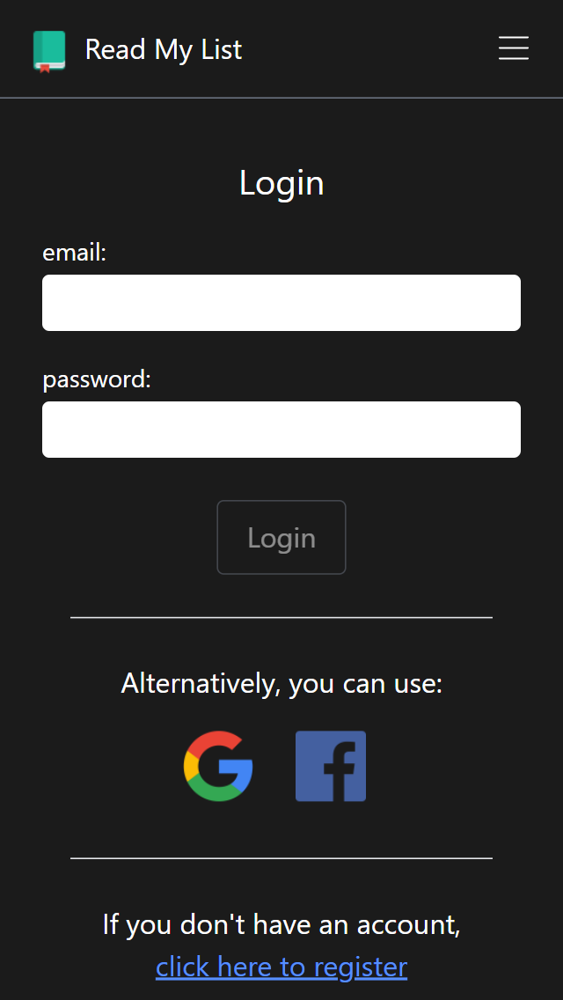
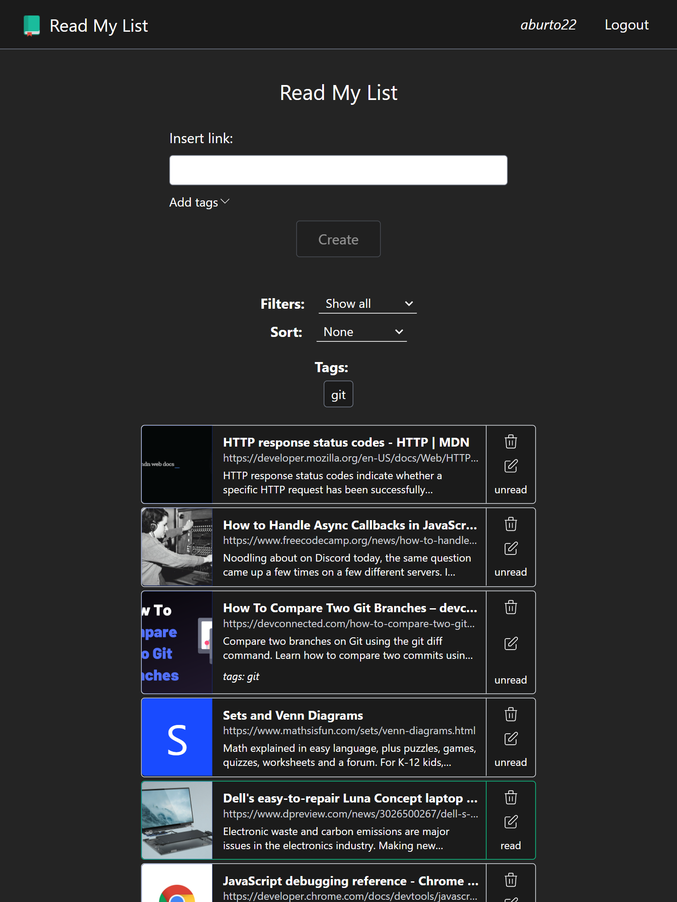
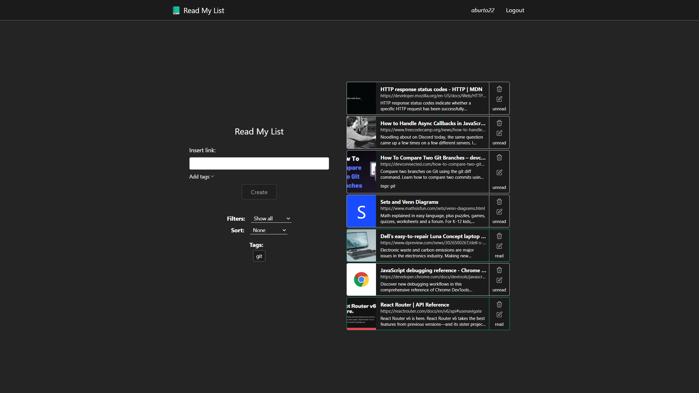

# Read my List
> An app conceived so users can manage their own reading list, creating labels and sorting items as they please.
>
> App is hosted in heroku [_Click here to take a look._](https://read-my-list.herokuapp.com/)

## Table of Contents
* [General Info](#general-information)
* [Technologies Used](#technologies-used)
* [Features](#features)
* [Screenshots](#screenshots)
* [Setup](#setup)
* [Project Status](#project-status)
* [New features](#new-features)
* [Authors](#authors)

## General Information
### Context
I have always loved to read many articles and page online, but always struggled to keep track of everything. Google and Safari have great tools, but you cannot share the list between browsers. This app is born from a need of a cross-browser reading-list I can use across my different device.

### Idea
Create a reading-list that users can manage and sort. Users can create tags and assign them to links, so they can quickly sort their reading needs. Reading list is saved to external database, so users can access their list everywhere.

## Technologies Used
### Front-end
- TypeScript
- React
- Tailwind CSS

### Back-end
- TypeScript
- Express.JS
- Passport.JS
- OAuth with Google
- OAuth with Facebook

### Database
- MongoDB

### Deployment and hosting
- Heroku hosting

## Features
So far, I have incorporated the following features:
- Users can register with e-mail, or use google or facebook login.
- Users can add links to their reading-list.
- Users can add tags to links, to categorize them and find them quickly.
- Users can sort or filter links.

## Screenshots

## Setup
The project is separated in two parts: client and server. If anybody wants to clone this project, they have to go into the client folder and install dependencies using `npm install`, and then run the development server using `npm start`. To start the server, they have to go into the api folder and install dependencies using `npm install`, and then run the development server using `npm run nodemon`. A list with all scrips is found in the package.json files included in client and server folders.

In order to run a local copy, users need to include an .env file in the server folder with the following information:
- MONGO_USER - User for MongoDB
- MONGO_PASSWORD - Password for MongoDB
- MONGO_DB - Database for MongoDB
- GOOGLE_CLIENT_ID - Google credentials to enable authentication with passport and oauth
- GOOGLE_CLIENT_SECRET - Google credentials to enable authentication with passport and oauth
- FACEBOOK_APP_ID - Facebook credentials to enable authentication with passport and oauth
- FACEBOOK_APP_SECRET - Facebook credentials to enable authentication with passport and oauth
- SESSION_SECRET_DEV - Secret to store sessions for development
- SESSION_SECRET_PROD - Secret to store sessions for production

## Project Status
The project is completed, but additional features might be included in the future.

## New features and bugs
Known bugs:
- Sometimes when initially loading the main page for a logged-in user, existing items won't be displayed. Refreshing loads everything correctly.

Future features:
- Allow not logged-in users to use the app by using local storage.

## Authors
This project was by:
- Alejandro Aburto Salazar - [GitHub](https://github.com/aburto22)